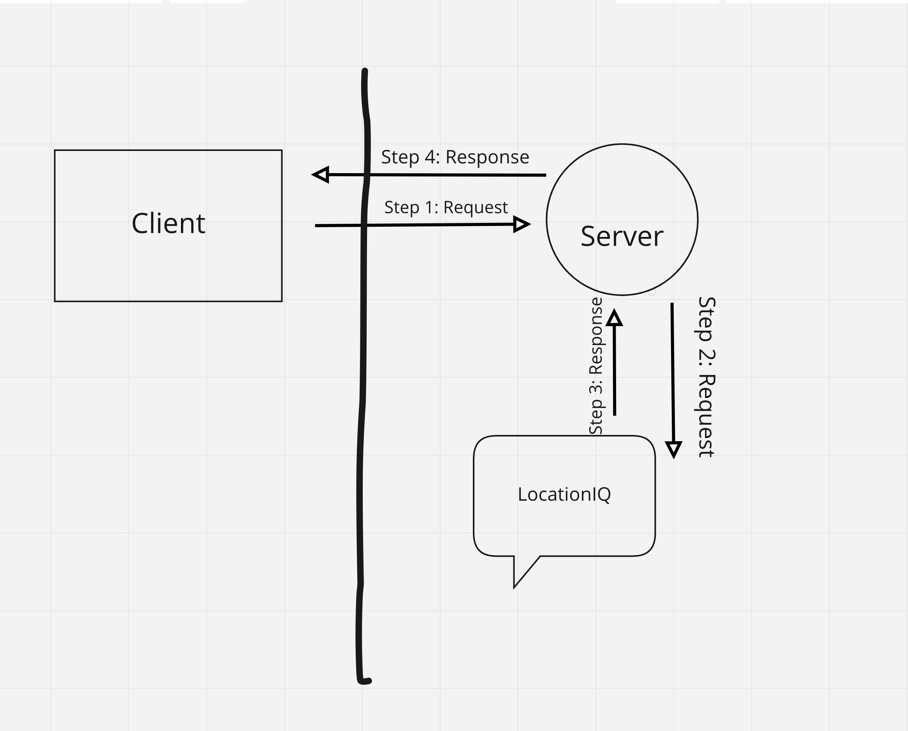

# City Explorer 

**Author**: Chuck Altopiedi
**Version**: 1.0.0 (increment the patch/fix version number if you make more commits past your first submission)

## Overview
This application was made to give users the opportunity to explore different cities by requesting a city. They are given the city, state, a map of the city, and the longitude and latitude of the city.

## Getting Started
They must build a react app and connect it to github. they must import react. they must build an app react component.

## Architecture
the application is built using vscode, react, html, css, javascript, bootstrap, and locationiq API.
<!-- Provide a detailed description of the application design. What technologies (languages, libraries, etc) you're using, and any other relevant design information. -->

## Change Log
<!-- Use this area to document the iterative changes made to your application as each feature is successfully implemented. Use time stamps. Here's an example:

01-01-2001 4:59pm - Application now has a fully-functional express server, with a GET route for the location resource. -->

## Credit and Collaborations

<!-- Give credit (and a link) to other people or resources that helped you build this application. -->
Time Estimates
For each of the lab features, make an estimate of the time it will take you to complete the feature, and record your start and finish times for that feature:

Name of feature: lab 6 asynchronous cod, and API's

Estimate of time needed to complete: 5 hours

Start time: 4:00 monday

Finish time: 8:00 tuesday

Actual time needed to complete: 8 hours

